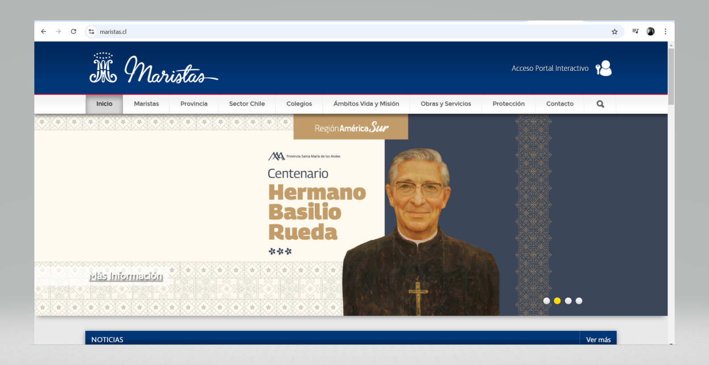
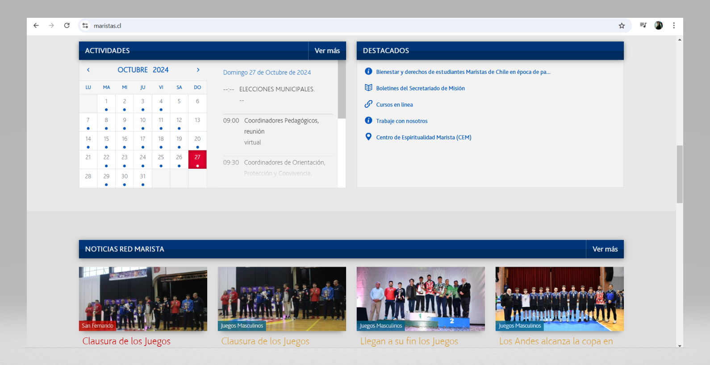
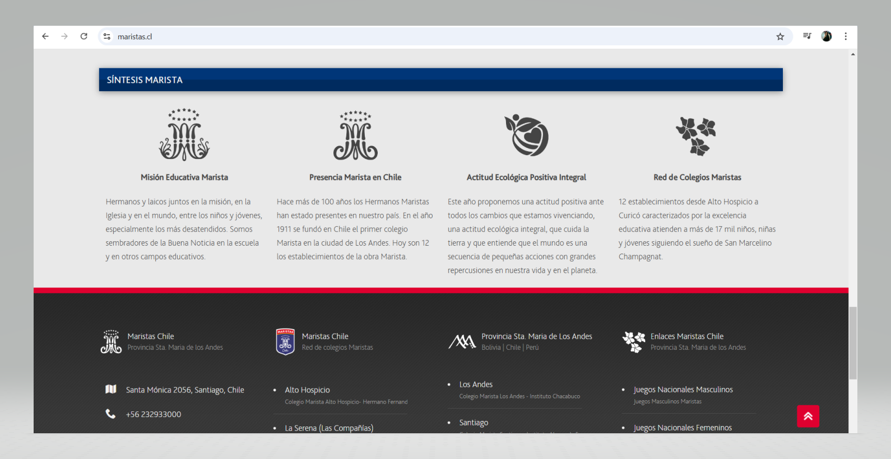
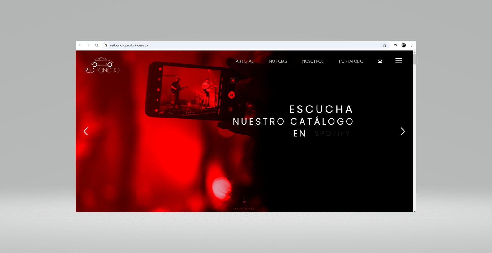
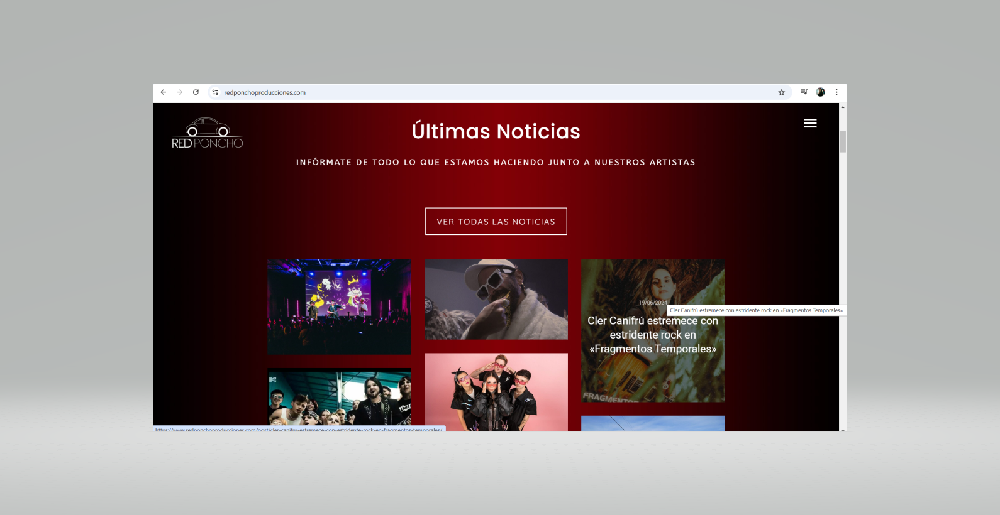
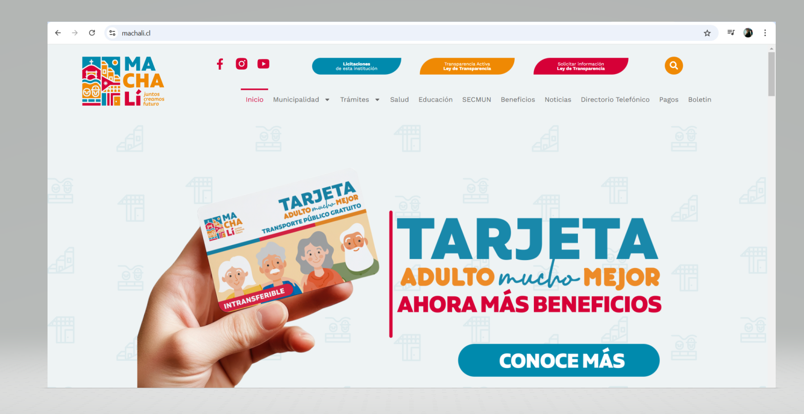
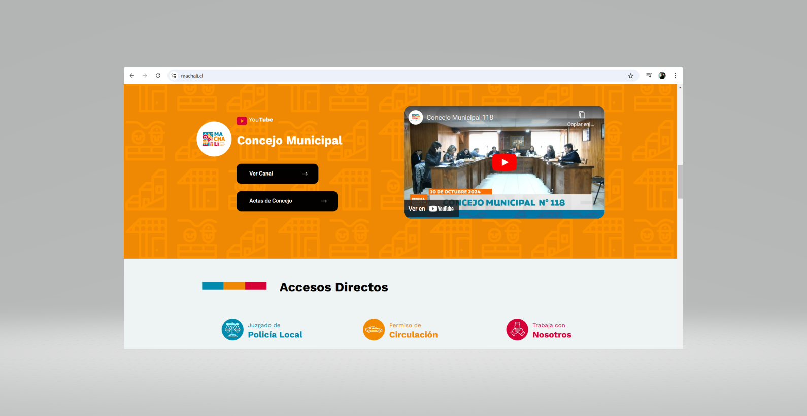
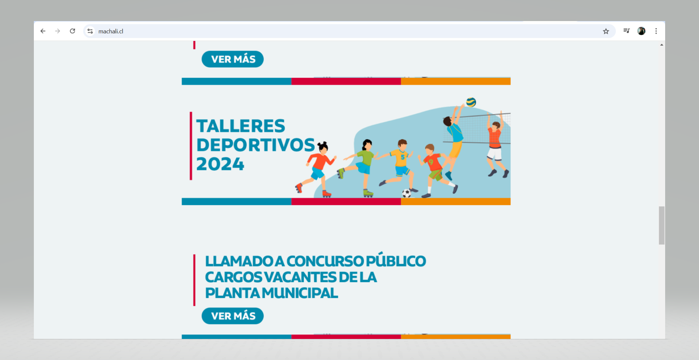

**Explicación del Diseño del Sitio Webstory**  
El diseño del sitio webstory se estructura en cuatro páginas principales: Inicio, Datos y Gráficos, Metodología y Conclusiones. A continuación, se describen los principios de estructura de la información, jerarquía visual y ubicación y diseño base de los elementos de la interfaz para cada una de estas páginas, siguiendo un enfoque que prioriza la claridad en la navegación, la presentación de datos y una disposición coherente.

**1\. Inicio**  
Estructura de la información: La página de inicio tiene como objetivo principal introducir a los usuarios a la webstory, explicando brevemente la hipótesis y el propósito del reportaje. La estructura comienza con un encabezado que contiene el menú de navegación, seguido de una sección hero con el título principal y un botón de acción. Posteriormente, se incluye un breve resumen del proyecto y enlaces a las secciones clave, finalizando con un pie de página que ofrece accesos rápidos.

Jerarquía visual: El título principal, “¿Las políticas de lectura mejoran la comprensión en Chile?”, ocupa el espacio más destacado para captar de inmediato la atención del usuario. El botón de acción “Explorar Datos” está ubicado debajo del título, de manera prominente para incentivar la interacción. Los elementos visuales, como imágenes o ilustraciones representativas, complementan el contenido textual, pero no deben opacar la importancia del mensaje principal.

**Ubicación y diseño base de los elementos de la interfaz:**

El menú de navegación (que será el mismo en todas las páginas) se coloca en la parte superior derecha, accesible desde cualquier página, facilitando la movilidad entre las distintas secciones.  
La sección hero con el título y el botón de acción ocupa la parte central, abarcando la mayor parte de la pantalla inicial, para guiar al usuario de manera clara hacia los datos.

**2\. Datos y Gráficos**  
Estructura de la información: Esta página se organiza alrededor de gráficos y filtros interactivos que permiten al usuario explorar la relación (mediante filtros) entre las políticas de lectura y los resultados de comprensión lectora en distintas regiones. Los gráficos están acompañados de breves explicaciones. 

**Jerarquía visual**: Los gráficos son los elementos centrales de la página y, por tanto, están ubicados en el centro del diseño. Cada gráfico cuenta con una breve descripción justo debajo que explique los datos presentados. Los filtros interactivos se colocan como un botón. 

**Ubicación y diseño base de los elementos de la interfaz:**

Los gráficos ocupan la parte central de la pantalla, asegurando su prominencia y fácil interpretación.  
Los filtros interactivos permiten personalizar la visualización de los datos por región, género o nivel socioeconómico.  
Cada gráfico cuenta con su texto explicativo inmediatamente debajo, en un tamaño de fuente más pequeño que el título pero suficientemente visible para que los usuarios lo comprendan sin esfuerzo.

**3\. Metodología**  
Estructura de la información: La página de metodología está destinada a detallar las fuentes de datos utilizadas y el proceso de análisis. La información se divide en secciones claramente definidas para que el usuario pueda seguir el flujo del contenido sin dificultad.

Jerarquía visual: El título de la página “Metodología del Reportaje” es el primer elemento visible. Las secciones están bien definidas mediante subtítulos que organizan el contenido en bloques: Fuentes de datos, Proceso de análisis y Limitaciones. Cada una de estas secciones sigue un orden descendente en términos de importancia visual, utilizando iconos o marcadores que faciliten la lectura.

Ubicación y diseño base de los elementos de la interfaz:

El título y los subtítulos se presentan de manera clara, con tamaños de fuente grandes para definir las distintas secciones.  
Los bloques de texto están separados visualmente por iconos o recuadros que destacan los puntos clave, lo que facilita que el usuario navegue entre las secciones sin confusión.  
La estructura sigue un diseño vertical simple, donde cada sección fluye de manera natural hacia la siguiente.

**4\. Conclusiones**  
Estructura de la información: La página de conclusiones está dedicada a presentar los hallazgos finales del reportaje, organizados en un resumen general, con detalles específicos por región, género y nivel socioeconómico. También incluye un gráfico final que resume los datos de manera visual.

Jerarquía visual: El resumen general estará en la parte superior, con un formato destacable, seguido de los detalles específicos. Las conclusiones más detalladas están organizadas en párrafos cortos con marcadores o viñetas que permiten una lectura rápida. El gráfico final ocupa un lugar destacado para que el usuario pueda visualizar fácilmente los hallazgos principales.

Ubicación y diseño base de los elementos de la interfaz:

El resumen se presenta en la parte superior de la página, destacándose como el elemento más importante.  
Los detalles específicos se ubican justo debajo, con bloques de texto. El gráfico final está centrado en la pantalla, con un título que explica los resultados.

Cada página del sitio sigue una estructura clara con una jerarquía visual que destaca los elementos más importantes y una ubicación lógica de los elementos de la interfaz. El diseño asegura que el contenido sea accesible y fácil de seguir, permitiendo a los usuarios explorar los datos y comprender la relación entre las políticas de lectura y la comprensión lectora en Chile.

**Compilado de antecedentes y referentes**
- Maristas Chile: Es un sitio web de un sector educativo de Chile, cuya interfaz es simple y diseño sólido. Amigable con todos los dispositivos y de navegación intuitiva.
  [Ver el sitio web de Maristas Chile]([URL](https://www.maristas.cl/))
  
  
  
  
- Red Poncho Producciones: Es un sitio web de una productora musical nacional. Si bien es totalmente ajeno a nuestro enfoque, su interfaz simple nos identifica. Tiene un *open* con fluidez y una barra de contenidos simple, como lo que nosotras queremos reflejar. Además, a medida que se hace *scrolling* se puede ir conociendo las propuestas de la productora, algo que queremos imitar en Chile en Páginas.
  [Ver el sitio web de Red Poncho Producciones]([URL](https://www.redponchoproducciones.com/))
  
  
  

- Municipalidad de Machalí: Claro, simple y de fácil acceso, pero además, el sitio web de la comuna de Machalí tiene una paleta de colores muy similares a la que queremos ocupar. Además de tener elementos visuales creativos, tales como los que queremos implementar en nuestra webstory, una iconografía simple y simpática. 
  [Ver el sitio web de la Municipalidad de Machalí]([URL](https://machali.cl/))
  
  
  
